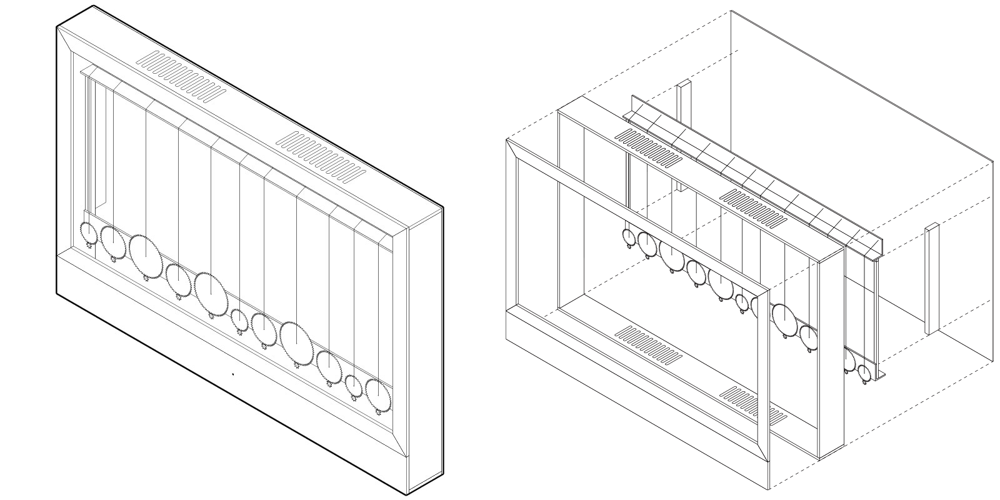

# Zutorie

By repurposing some of the mechanical components of a guitar, I am transforming a musical instrument into a reactive kinetic sculpture. The cabinet houses an array of guitar strings, which motors tighten or loosen to the point of sometimes breaking them.

By deconstructing a guitar—an instrument with which I have expressed myself for years—and reorganizing its components into a visual device, I am pushing further my practice of post-rock—in which rock instruments are used to create non-rock music—to the point where instruments are used to create non-music, e.g. visual arts.

Read more about my process on [my academic blog](https://academia.jansensan.net/category/imca-400/).